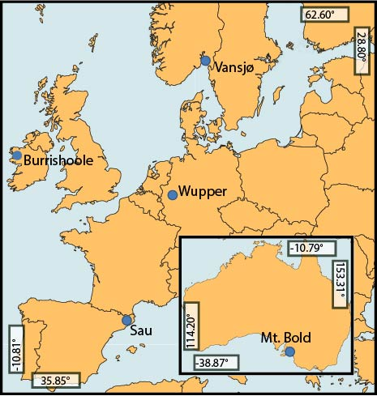
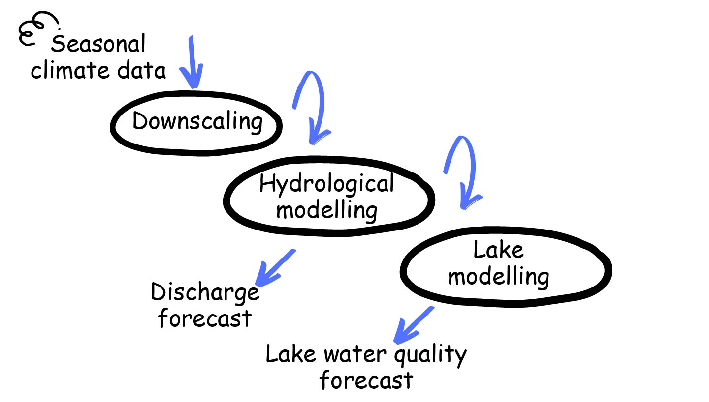

# Introduction

As part of the WATExR project, we have developed tools for seasonal forecasting of river discharge, lake water temperature, ecology and fish phenology. The aim is for stakeholders to have access to probabilistic aquatic forecasts driven by state-of-the-art seasonal climate projections. Forecasts provide an indication of the expected average environmental conditions during the coming 1 to 9 months.

Forecasting tools were developed for five pilot case sites, one in Australia and four in Europe.

  

# Forecasting methods

Forecasts were produced by driving freshwater "impact" models using downscaled seasonal climate model forecasts.

  

## Accessing and processing seasonal climate data

We used [ECMWF's SEAS5](https://www.ecmwf.int/en/newsletter/154/meteorology/ecmwfs-new-long-range-forecasting-system-seas5) seasonal climate model forecasts. These can be accessed directly through the [Copernicus Climate Data Store](https://cds.climate.copernicus.eu/#!/home), and you will find an example script for downloading data directly from Copernicus [here](https://nbviewer.jupyter.org/github/NIVANorge/seasonal_forecasting_watexr/blob/master/Norway_Morsa/MetData_Processing/notebooks/05_download_era5.ipynb)). However, in WATExR, seasonal climate data were primarily  downloaded directly from the Santander Meteorology Group's [User Data Gateway](https://meteo.unican.es/trac/wiki/udg), using R scripts in [this folder](https://github.com/NIVANorge/seasonal_forecasting_watexr/tree/main/ClimateDataDownloadScripts). These scripts make use of the [Climate4R](https://www.meteo.unican.es/en/climate4R) package both for data download and post processing. This data is only historic and was used for the development and evaluation of the forecasting tools, and therefore cannot be used for operational forecasting. Many of the functions in the scripts in this folder can however be reused for operational forecasting.

## Impact modelling

Statistical and process-based models were used to produce seasonal forecasts for variables that were relevant in the various case study sites. These included, for example, catchment hydrology, lake temperature, lake ice cover, lake water quality and ecological status, and the timing of seaward fish migration.

# Case study sites

## [Burrishoole catchment, Ireland](https://github.com/NIVANorge/seasonal_forecasting_watexr/blob/main/docs/Ireland.md)
**The challenge**: Better understanding and management of diadromous fish stocks, in particular the timing of fish migration.

**Forecasting tool**: All code and documentation required for data access, pre-processing and statistical analyses are available via download of the EcoCountForecastR R package available at <https://github.com/as-french/EcoCountForecastR>

**Developer and co-developer**: [Marine Institute](https://www.marine.ie/Home/home)

**Main contacts**: Andrew French, Elvira de Eyto

## [Sau reservoir, Spain](https://github.com/NIVANorge/seasonal_forecasting_watexr/blob/main/docs/Spain.md)
**The challenge**: Improved reservoir management to reduce flooding and improve water quality for drinking water and to meet ecological targets.

**Forecasting tool**: A QGIS plugin is under development. Expected first version summer 2021.

**Developer and co-developer**: [ICRA](https://www.icra.cat/), [Catalan Water Agency](http://aca.gencat.cat/ca/inici)

**Main contacts**: Daniel Mercado Bettín, Rafael Marcé

## [Lake Vansjø, Norway](https://github.com/NIVANorge/seasonal_forecasting_watexr/tree/main/Norway_Morsa#lake-vansj%C3%B8-norway)
**The challenge**: Manage lake water levels and farming practices in the catchment to improve water quality and achieve water quality and ecology targets, including prevention of toxic cyanobacterial blooms.

**Forecasting tool**: <https://watexr.data.niva.no>. This was developed using a voila app; the underlying code is in [this GitHub repository](https://github.com/NIVANorge/watexr_voila_app)

**Developer and co-developer**: Norwegian Institute for Water Research ([NIVA](https://www.niva.no/)), [Morsa](http://morsa.org/)

**Main contacts**: Leah Jackson-Blake, François Clayer

## [Wupper reservoir, Germany](https://github.com/NIVANorge/seasonal_forecasting_watexr/blob/main/docs/Germany.md)
**The challenge**: Improved reservoir operations to meet requirements for flood protection, recreation and improved water quality both in the reservoir and downstream.

**Forecasting tool**: R shiny app coming soon (expected summer 2021)

**Developer and co-developer**: [UFZ](https://www.ufz.de/index.php?en=33573), [WUPPERVERBAND](https://www.wupperverband.de/internet/web.nsf/id/pa_startseite.html)

**Main contacts**: Muhammed Shikhani, Karsten Rinke

## [Mount Bold reservoir, Southern Autralia](https://github.com/NIVANorge/seasonal_forecasting_watexr/blob/main/docs/Australia.md)
**The challenge**: Improve management of the largest reservoir in South Australia to reduce pumping costs and improve water quality.

**Forecasting tool**: not developed for this site

**Developer and co-developer**: [Dundalk Institute of Technology](https://www.dkit.ie/), [SA Water](https://www.sawater.com.au/) and [University of Adelaide](https://www.adelaide.edu.au/)

**Main contacts**: Tadhg Moore, Eleanor Jennings

# Papers
Four papers are currently published/submitted/in preparation, and provide details on the workflows developed at each site, as well as lessons learned throughout the project in terms of key opportunities and barriers for seasonal forecasting to support water management:

* [Mercado et al. (in review)](https://github.com/NIVANorge/seasonal_forecasting_watexr/tree/main/paper1_Mercado_etal): A description of the workflows developed to simulate discharge and lake temperature.
* [Clayer et al. (in prep)](https://github.com/NIVANorge/seasonal_forecasting_watexr/tree/main/paper2_Clayer_etal): Exploration of the sources of skill in seasonal forecasts.
* [Jackson-Blake et al. (in prep)](https://github.com/NIVANorge/seasonal_forecasting_watexr/tree/main/paper3_JacksonBlake_etal): Assessment of how useful forecasts are for supporting decision making in the water sector.
* A. French et al. (in prep): Description of workflow for seasonal forecasting of the timing of fish migration, with application of the workflow in the Burrishoole catchment in Ireland.

# Acknowledgements
This is a contribution of the WATExR project (watexr.eu/), which is part of ERA4CS, an ERA-NET initiated by JPI Climate, and funded by MINECO-AEI (ES), FORMAS (SE), BMBF (DE), EPA (IE), RCN (NO), and IFD (DK), with co-funding by the European Union (Grant 690462). MINECO-AEI funded this research through projects PCIN-2017-062 and PCIN-2017-092.
